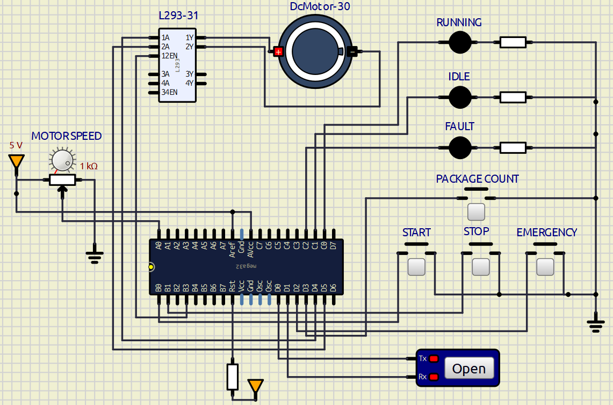

# Conveyor Control System

## What this is
A conveyor belt controller built on the ATmega32, using a layered MCAL/HAL/APP structure. It handles start/stop, variable speed via a potentiometer, object counting via an interrupt, and an emergency stop that locks the system until reset.

## Folder structure
MCAL - GPIO, EXTI, Timer, PWM, ADC, UART (direct register-level drivers)
HAL - DC Motor, Button, Sensor (built on top of MCAL)
APP - main.c, application logic only

## System flags
### All flags are volatile u8, start at 0.
- Flag_StartPressed - set/cleared by the start button poll
- Flag_StopPressed - set/cleared by the stop button poll
- Flag_EmergencyStop - set by the INT0 ISR, never cleared in software
- Flag_ConveyorRunning - set on start, cleared on stop or emergency
- Flag_ObjectDetected - set by the INT1 ISR, cleared once the count is updated
- Flag_SpeedChanged - set when the ADC speed band changes, cleared after logging

The main loop always checks Flag_EmergencyStop first. While it's set, everything else is skipped.

## Speed bands
0-340 -> Low (duty 85)
341-681 -> Medium (duty 170)
682-1023 -> High (duty 255)

## UART messages (9600, no parity, 1 stop bit, all ending in \r\n)
System Ready
Conveyor Running
Conveyor Stopped
Object Detected - Count: N
Speed Level: Low / Medium / High
Emergency Stop Activated

## Building it
1. New AVR XC8 project in Microchip Studio, target ATmega32.
2. Add the MCAL/HAL/APP folders and source files.
3. Add include paths for all three folders under project properties.
4. Build, then grab the .hex from Debug/Release.

## Testing
- Press start -> motor runs, Running LED on, "Conveyor Running" logged.
- Turn the pot through all three ranges -> speed changes, correct level logged once per change.
- Press the object button a few times while running -> count goes up correctly, logged each time. Press it while stopped -> nothing counted.
- Press stop -> motor stops, "Conveyor Stopped" logged.
- Press emergency while running -> motor stops immediately, Fault LED on, "Emergency Stop Activated" logged once, start button does nothing afterward.